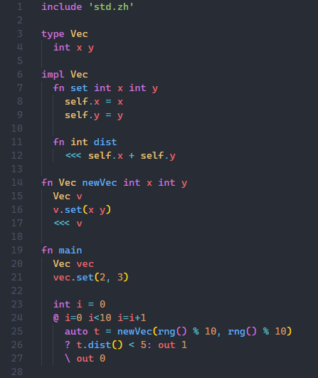

# Zhaba script
🐸 Zhaba(Russian: ˈʐabə, жаба(frog)) script - is a general purpose, open source, statically typed, compiled to C frog  programming language, focused at minimaizing code size.

Inpired by Rust, C++ and Python🐍

## Features:

- Full syntax highlighting

## Syntax highlighting demo:

## IMPORTANT !!!:
cute 🐸:

